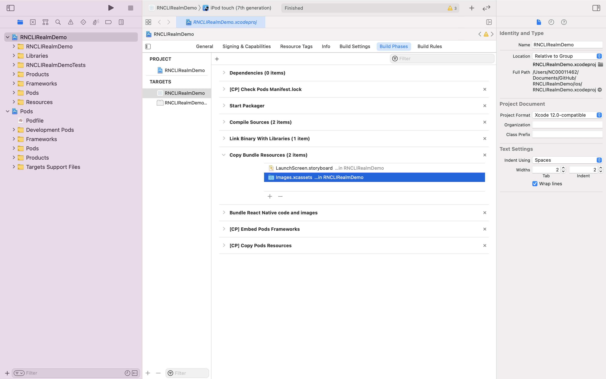

# rn-native-base-demo 🐳
- https://docs.nativebase.io/
- https://picsum.photos/seed/xxx/200/300
- **need check has this ERR or not when deploy: `expected a string (for built-in components) or a class/function (for composite components) but got: undefined`**


[](https://github.com/tquangdo/rn-native-base-demo/issues/new)

## usage
scan bar code on `expo go` appstore

## version
- `package.json`
```json
"expo": "~42.0.1",
"native-base": "2.13.8",
```
>`npm i --save-exact native-base@2.13.8`

## demos app NativeBaseDemo1.js

************************

************************


## demos app NativeBaseDemo2.js


## config xcode when run `native-base` on react-native proj
1.
```shell
yarn add native-base react-native-svg styled-components styled-system react-native-safe-area-context
cd ios/
pod install
```
2.
```shell
yarn react-native run-ios
```
-> will show ERR `Multiple commands produce... [CP] Copy Pods Resources`!!!
3. remove the font files from `Copy Bundle Resources`, so that they are only in [CP] Copy Pods Resources
************************

