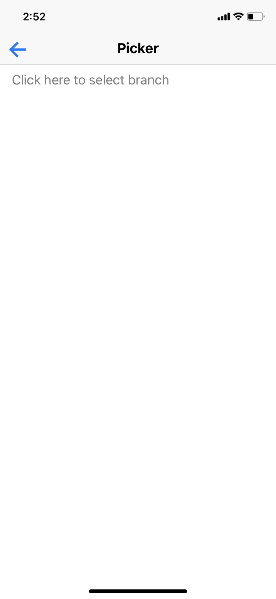

# rn-native-base-demo 🐳
https://docs.nativebase.io/


[](https://github.com/tquangdo/rn-native-base-demo/issues/new)

## usage
scan bar code on `expo go` appstore

## version
- `package.json`
```json
"expo": "~42.0.1",
"native-base": "2.13.8",
```
>`npm i --save-exact native-base@2.13.8`

## demos app

************************

************************
